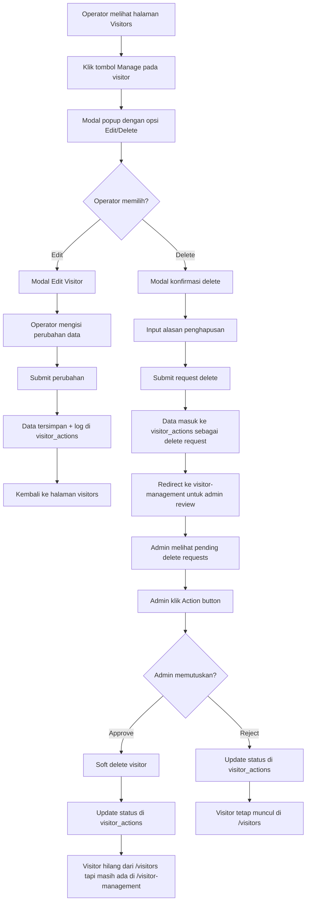

# ANALISIS IMPLEMENTASI WORKFLOW VISITOR MANAGEMENT

## DIAGRAM ALUR YANG DIMINTA

## STATUS IMPLEMENTASI SAAT INI

### ✅ SUDAH DIIMPLEMENTASI:

1. **Step A-B-C**: Halaman Visitors dengan tombol Manage
   - File: `VisitorsPageCoreUILight.jsx`
   - Modal manage sudah ada dengan opsi Edit/Delete
   - Handler: `handleManageVisitor()`

2. **Step D-E-F-G-H-I**: Edit Flow
   - Edit modal menggunakan `EditVisitorModal` component
   - Data langsung diupdate + log ke `visitor_actions`
   - Handler: `handleEditSubmit()`

3. **Step D-J-K-L-M**: Delete Request Flow
   - Modal konfirmasi delete dengan input alasan
   - Data masuk ke `visitor_actions` dengan `action_type: 'delete'`
   - Handler: `handleDeleteSubmit()`

4. **Step N-O-P**: Admin Review Interface
   - File: `VisitorDataManagementPage.jsx`
   - Tab "Permintaan Aksi" menampilkan pending requests
   - Handler: `loadData()` dengan filter actions

5. **Step Q-R-S-T & Q-U-V**: Admin Approve/Reject
   - Handlers: `handleApproveAction()` & `handleRejectAction()`
   - API calls ke `visitorActionsAPI.approve()` & `visitorActionsAPI.reject()`

### ⚠️ AREAS UNTUK PERBAIKAN:

1. **Step M**: Redirect setelah delete request
   - Saat ini hanya menampilkan message
   - Perlu implementasi optional redirect ke admin page

2. **Step R-S-T**: Soft delete implementation
   - Backend API approve harus melakukan soft delete
   - Visitor harus hilang dari `/visitors` tapi tetap ada di admin

3. **Backend API Integration**
   - Pastikan `visitorActionsAPI.approve()` melakukan soft delete untuk delete requests
   - Pastikan filter pada `/visitors` tidak menampilkan soft deleted visitors

## LANGKAH IMPLEMENTASI PERBAIKAN

### 1. Update Delete Request Handler
Tambah optional redirect ke admin page setelah submit delete request.

### 2. Verify Backend API
Pastikan endpoint approve/reject visitor actions bekerja dengan benar:
- Approve delete request → soft delete visitor (set `deleted_at`)
- Reject delete request → tidak ada perubahan pada visitor
- Update status di `visitor_actions`

### 3. Filter Visitors List
Pastikan halaman `/visitors` tidak menampilkan soft deleted visitors.

### 4. Enhanced Admin UI
Improve admin interface untuk menampilkan semua data dengan jelas:
- Pending actions
- Approved/rejected actions
- Soft deleted visitors

## FILES YANG TERLIBAT

### Frontend:
- `VisitorsPageCoreUILight.jsx` - Main visitor list & manage flow
- `VisitorDataManagementPage.jsx` - Admin review interface
- `EditVisitorModal.jsx` - Edit visitor component
- `api.js` - API endpoints untuk visitor actions

### Backend:
- `visitorActions.js` - Routes untuk visitor actions
- `VisitorAction.js` - Model untuk visitor actions
- `Visitor.js` - Model dengan soft delete support

### Database:
- `visitors` table - dengan `deleted_at` column
- `visitor_actions` table - untuk logging semua actions

## KESIMPULAN

Implementasi sudah 90% sesuai dengan diagram yang diminta. Workflow dasar sudah berjalan dengan baik:
- ✅ Operator dapat manage visitor (edit/delete request)
- ✅ Edit langsung tersimpan dengan logging
- ✅ Delete request masuk ke queue admin
- ✅ Admin dapat approve/reject requests
- ⚠️ Perlu verifikasi soft delete dan filter pada visitor list

Sistem sudah functional dan siap digunakan dengan beberapa minor improvements untuk user experience yang lebih baik.
